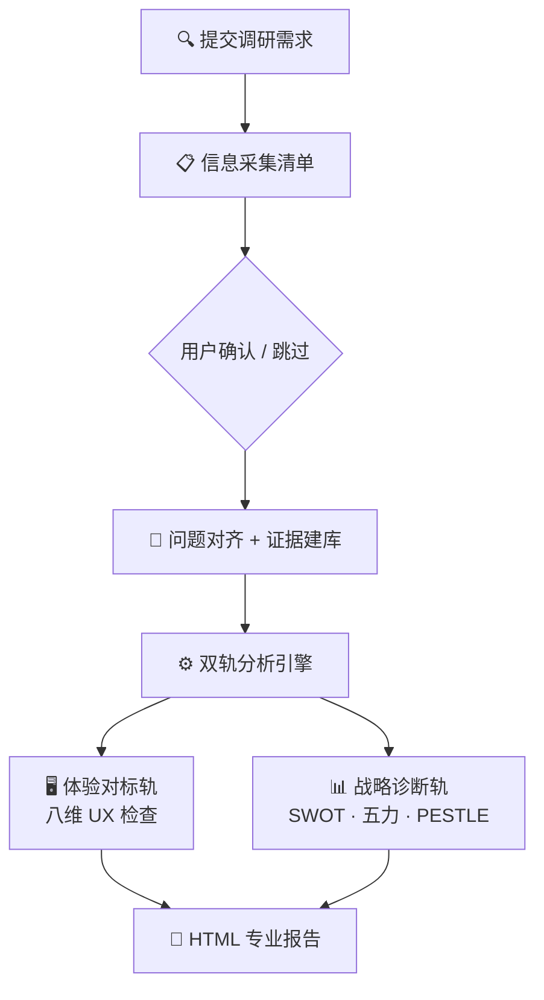

# 竞品调研专家

[English](README.md)

竞品分析不应该是功能清单的罗列。你真正需要的是结构化判断——哪些值得跟进、哪些应该超越、哪些可以忽略。

CPR 采用原创**双轨四层法**——体验对标（8 个 UX 维度）+ 战略诊断（SWOT、五力、PESTLE）——先通过信息采集清单收集充分上下文，再输出**证据可溯源的专业 HTML 报告**。

## 工作流程



## 双轨方法

| 轨道 | 回答问题 | 维度 |
|------|---------|------|
| 体验对标 | "竞品具体怎么做？我方差在哪？" | 8 个 UX 维度（架构、交互、视觉、文案、行为、异常、跨端、合规） |
| 战略诊断（可选） | "赛道为什么这样竞争？我方怎么打？" | 竞争格局、SWOT、波特五力、PESTLE |

## 你会得到什么

一份**专业 HTML 报告**，证据可追溯：

- **竞品对标总览表**——场景 × 产品 × 维度，一张表看清差异
- **关键发现**——洞察 / 警告 / 风险级，每条挂 `SRC-xxx`
- **战略分析**——SWOT 行动矩阵、五力温度、PESTLE 信号面板（启用时）
- **可复用模式**——跨产品设计模式，值得借鉴的做法
- **执行路线图**——优先级 + 动作 + 影响 + 复杂度 + Owner
- **证据索引**——全部证据卡片，可追溯可审计

## 适用场景

- **产品经理**：评审前竞品材料准备、排期会支撑资料
- **UX 设计师**：体验差距分析、跨产品模式发现
- **战略团队**：市场定位、差异化、进入壁垒评估
- **创始人**：融资或转型前看清竞争格局

## 一句话启动

```text
我们APP发帖转化率仅3%，请对标小红书和Instagram，分析发帖首链路问题。
我方现状：右上角入口+空白编辑器+无自动草稿。
```

## 安装

```bash
openclaw skills install competitive-product-research
```

---

> 别做功能清单式竞品分析。先判断哪些值得跟进、哪些应该超越、哪些可以忽略。

License: MIT
