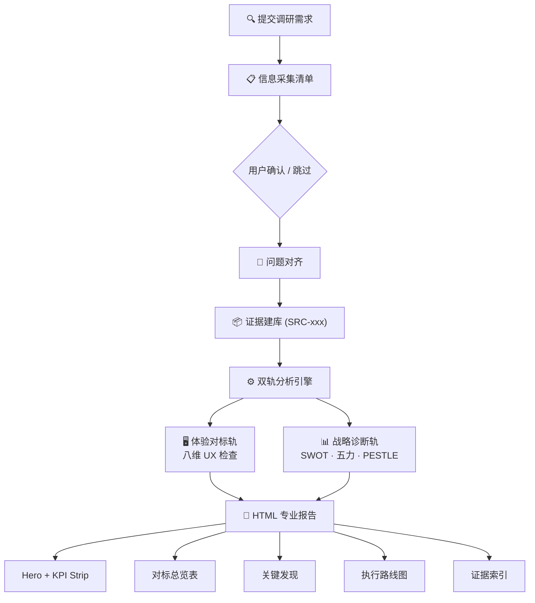

# 竞品调研专家

[English](README.md)

> 你的团队在逐个抄竞品功能。你真正需要的是结构化分析——告诉你该抄什么、该超越什么、该跳过什么。

CPR 采用原创**双轨四层法**——体验对标（8 个 UX 维度）+ 战略诊断（SWOT、五力、PESTLE）——先通过信息采集清单收集充分上下文，再输出**证据可溯源的专业 HTML 报告**。

## 这个技能擅长什么

- 将竞品观察转化为**可执行的决策行动**
- 保持结论**可追溯到证据**（`SRC-xxx`）
- 分离**体验差距**和**战略选择**，避免逻辑混淆

## 工作流



## 双轨方法

| 轨道 | 回答问题 | 维度 |
|------|---------|------|
| 体验对标 | "竞品具体怎么做？我方差在哪？" | 8 个 UX 维度（架构、交互、视觉、文案、行为、异常、跨端、合规） |
| 战略诊断（可选） | "赛道为什么这样竞争？我方怎么打？" | 竞争格局、SWOT、波特五力、PESTLE |

## 报告章节（HTML）

| # | 章节 | 说明 |
|---|------|------|
| 1 | Hero | 调研目标、一句话结论、结论标签 |
| 2 | KPI Strip | 产品数 / 发现数 / Pattern 数 / 行动项数 |
| 3 | Callouts | Top Insight / Priority Action |
| 4 | Research Scope + Source Coverage | 范围定义 + 证据覆盖度 |
| 5 | Summary Conclusions | 3 条核心结论 |
| 6 | Competitive Benchmark Table | 场景 × 产品 × 维度 |
| 7 | Strategic Analysis | SWOT + 五力 + PESTLE（启用时） |
| 8 | Key Findings | 洞察 / 警告 / 风险级发现 |
| 9 | Reusable Patterns | 跨产品设计模式（可选） |
| 10 | Implementation Roadmap | 优先级 + 动作 + 影响 + 复杂度 + Owner |
| 11 | Source Index | 全部 SRC-xxx 证据卡片 |
| 12 | Disclaimer | AI 生成声明 |

## 核心约束

- 不编造数据——不可验证的标注为"未见公开数据"
- 不做无依据的结论——每条结论挂 `SRC-xxx`
- 不写模糊的行动项——必须含 Owner、优先级、依赖
- 始终先采集信息再生成报告
- 分享模式必须脱敏

## 快速启动

```text
我们APP发帖转化率仅3%，请对标小红书和Instagram，分析发帖首链路问题。
我方现状：右上角入口+空白编辑器+无自动草稿。
```

## 核心文件

| 文件 | 职责 |
|------|------|
| `SKILL.md` | 主规则（工作流 + 输出规范 + 硬约束） |
| `references/research-playbook.md` | 调研方法手册（证据规则、八维检查清单、战略工具箱） |
| `references/report-template-pro.html` | HTML 报告模板（浅蓝 Hero 风格，12 分区） |
| `references/factual-reporting-and-style.md` | 事实核查与文风约束 |

## 安装

```bash
openclaw skills install competitive-product-research
```

License: MIT
