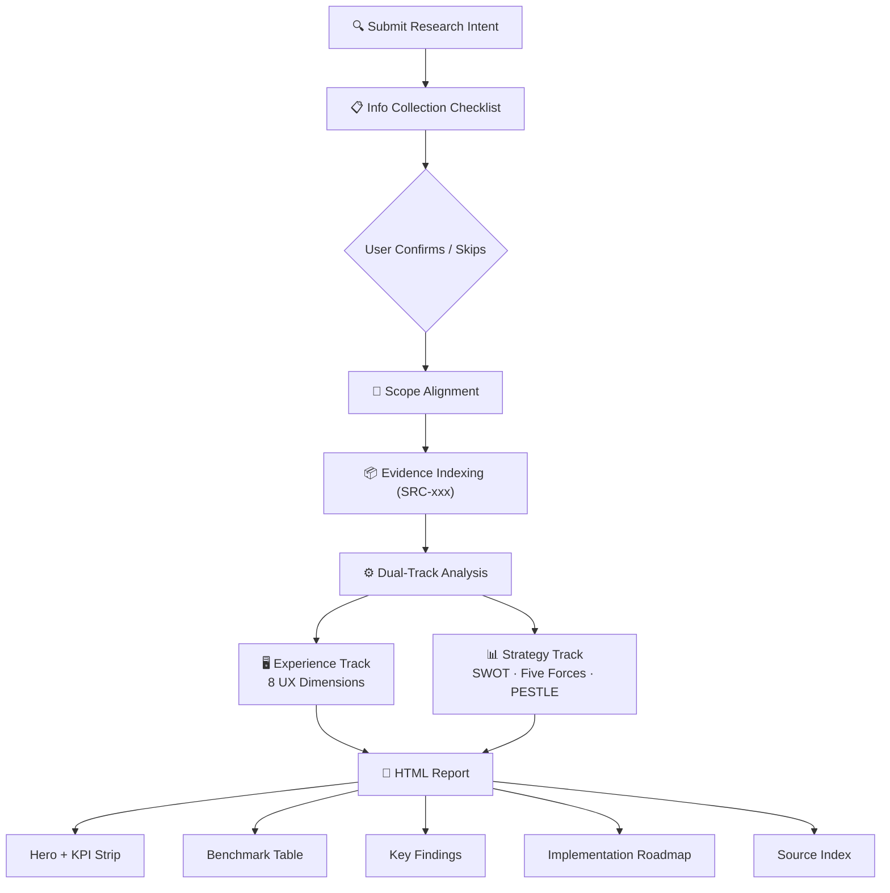

# Competitive Product Research

[中文版](README-zh.md)

> Your team is copying competitors feature by feature. What you need is structured analysis that tells you what to copy, what to leapfrog, and what to skip.

CPR uses an original **dual-track method** — experience benchmarking (8 UX dimensions) + strategic diagnostics (SWOT, Five Forces, PESTLE) — collects sufficient context via a structured checklist, then produces a **source-traceable professional HTML report** with actionable recommendations.

## What This Skill Is Optimized For

- Turning competitor observations into **decision-ready actions**
- Keeping conclusions **traceable to evidence** (`SRC-xxx`)
- Separating **experience gaps** from **strategy choices** to avoid mixed logic

## Workflow



## Dual-Track Method

| Track | Answers | Dimensions |
|-------|---------|------------|
| Experience Benchmarking | "How do they do it? Where's our gap?" | 8 UX dimensions (architecture, interaction, visual, copy, behavior, edge cases, cross-platform, compliance) |
| Strategic Diagnostics (optional) | "Why does competition look this way? How should we compete?" | Competitive landscape, SWOT, Porter's Five Forces, PESTLE |

## Output Sections (HTML)

| # | Section | Description |
|---|---------|-------------|
| 1 | Hero | Research goal, one-line conclusion, verdict pill |
| 2 | KPI Strip | Products / findings / patterns / action items |
| 3 | Callouts | Top Insight / Priority Action |
| 4 | Research Scope + Source Coverage | Scope definition + evidence coverage grid |
| 5 | Summary Conclusions | 3 key conclusions |
| 6 | Competitive Benchmark Table | Scenario × Product × Dimension |
| 7 | Strategic Analysis | SWOT + Five Forces + PESTLE (when enabled) |
| 8 | Key Findings | Insight / warning / risk level findings |
| 9 | Reusable Patterns | Cross-product design patterns (optional) |
| 10 | Implementation Roadmap | Priority + action + impact + complexity + owner |
| 11 | Source Index | All SRC-xxx evidence cards |
| 12 | Disclaimer | AI-generated notice |

## Key Constraints

- No fabricated numbers — unverifiable data marked as such
- No unsupported claims — every conclusion has `SRC-xxx`
- No vague action items — must have owner, priority, dependencies
- Always collect information before generating
- Shareable mode must desensitize sensitive info

## Quick Start

```text
Our app's posting conversion rate is only 3%. Benchmark against Xiaohongshu and Instagram,
analyze first-posting funnel issues.
Current state: top-right entry + blank editor + no auto-draft.
```

## Core Files

| File | Role |
|------|------|
| `SKILL.md` | Master rules (workflow + output spec + constraints) |
| `references/research-playbook.md` | Detailed methods (evidence rules, 8-dim checklist, strategy toolkit) |
| `references/report-template-pro.html` | HTML report template (light-blue hero, 12 sections) |
| `references/factual-reporting-and-style.md` | Fact-checking and style constraints |

## Install

```bash
openclaw skills install competitive-product-research
```

License: MIT
