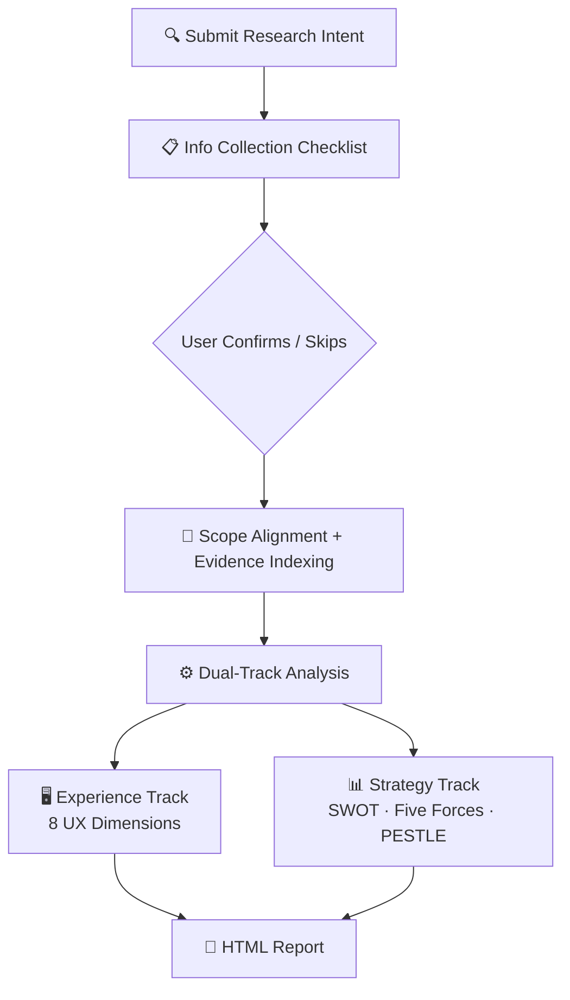

# Competitive Product Research

[中文版](README-zh.md)

Competitive analysis shouldn't be a feature checklist. What you actually need is structured judgment — what to follow, what to leapfrog, and what to ignore.

CPR uses an original **dual-track method** — experience benchmarking (8 UX dimensions) + strategic diagnostics (SWOT, Five Forces, PESTLE) — collects sufficient context via a structured checklist, then produces a **source-traceable professional HTML report** with actionable recommendations.

## Workflow



## Dual-Track Method

| Track | Answers | Dimensions |
|-------|---------|------------|
| Experience Benchmarking | "How do they do it? Where's our gap?" | 8 UX dimensions (architecture, interaction, visual, copy, behavior, edge cases, cross-platform, compliance) |
| Strategic Diagnostics (optional) | "Why does competition look this way? How should we compete?" | Competitive landscape, SWOT, Porter's Five Forces, PESTLE |

## What You Get

A **professional HTML report** with source-traceable evidence:

- **Competitive Benchmark Table** — scenario × product × dimension comparison
- **Key Findings** — insight / warning / risk level, each backed by `SRC-xxx`
- **Strategic Analysis** — SWOT action matrix, Five Forces temperature, PESTLE signals (when enabled)
- **Reusable Patterns** — cross-product design patterns worth adopting
- **Implementation Roadmap** — priority + action + impact + complexity + owner
- **Source Index** — all evidence cards, traceable and auditable

## Use Cases

- **Product Managers**: Pre-review competitive materials, informed prioritization
- **UX Designers**: Experience gap analysis, cross-product pattern discovery
- **Strategy Teams**: Market positioning, differentiation, entry barrier assessment
- **Founders**: Competitive landscape clarity before fundraising or pivoting

## Quick Start

```text
Our app's posting conversion rate is only 3%. Benchmark against Xiaohongshu and Instagram,
analyze first-posting funnel issues.
Current state: top-right entry + blank editor + no auto-draft.
```

## Install

```bash
openclaw skills install competitive-product-research
```

---

> Skip the feature checklist. Decide what to follow, what to leapfrog, and what to ignore.

License: MIT
