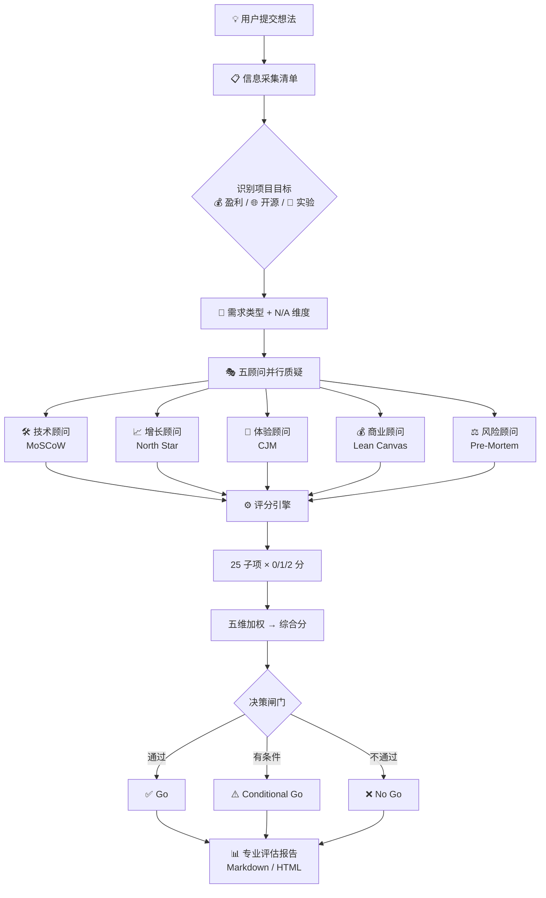

# 一人董事会

[English](README.md)

每个人都想做一人公司——自由、不受限、按自己的节奏赚钱。

**但想法从脑子到落地，中间全是坑。** 问朋友，朋友说"不错啊"。问 AI，AI 说"这是一个很好的想法"。你真正需要的，是有人认真帮你拍砖。

一人董事会给你配了 5 位专业顾问，从五个维度压测你的想法，输出一份**带确定性评分的专业评估报告**——不是鸡汤，是可执行的 Go / No Go 决策。

## 工作流程



## 五位专业顾问

| 顾问 | 他会问你什么 |
|---|---|
| 🛠️ 技术顾问 | 一个人做得出来吗？维护谁来扛？ |
| 📈 增长顾问 | 用户从哪来？一个人怎么推？ |
| 🎨 体验顾问 | 用户真的会用吗？ |
| 💰 商业顾问 | 算过账吗？跑道烧完怎么办？ |
| ⚖️ 风险顾问 | 出了问题一个人兜得住？ |

## 内置分析框架

评估不是拍脑袋。五维评分背后集成了五套经过验证的分析模型，每位顾问配备专属工具：

| 框架 | 顾问 | 解决什么问题 |
|------|------|-------------|
| **MoSCoW** | 🛠️ 技术顾问 | Must/Should/Could/Won't 四级裁剪，帮你砍到一个人真做得完 |
| **North Star Metric** | 📈 增长顾问 | 帮你找到那个判断产品活着还是死了的核心指标 |
| **Customer Journey Map** | 🎨 体验顾问 | 7 阶段用户旅程审视，找出体验断裂点 |
| **Lean Canvas** | 💰 商业顾问 | 用 9 块画布结构化审视你的商业模式是否完整 |
| **Pre-Mortem** | ⚖️ 风险顾问 | 把风险分成 Tigers / Paper Tigers / Elephants 三类 |

## 你会得到什么

一份**专业评估报告**（默认 Markdown，可升级为可视化 HTML 报告）：

- **五维可行性评分**（0-100）——25 个子项逐项打分，公式计算，不靠感觉
- **致命死穴 + 救命稻草**——一针见血指出最大风险和最大机会
- **MoSCoW MVP 范围裁剪**——Must / Should / Could / Won't，帮你砍到一个人真做得完
- **用户旅程审视**——7 阶段 Customer Journey Map，找出体验断裂点和 Aha Moment
- **Pre-Mortem 风险分类**——🐯 Tigers / 📄 Paper Tigers / 🐘 Elephants，开干之前先想清楚怎么死
- **OPC 决策卡**——✅ 独立完成 / ⚠️ 找外援 / ❌ 砍掉 + 3周/6周/3月时间盒
- **行动清单**——谁在什么时间前完成什么

## 适用场景

- **独立开发者**：一个人做 SaaS / 工具 / 插件，缺多角度声音
- **开源作者**：开源项目启动前，评估可持续性和社区价值
- **SaaS 创始人**：决策没人帮你压测，需要外部视角
- **内容创作者**：新栏目 / 课程 / 社群上线前自检
- **独立咨询师**：给客户出方案前内部推演
- **任何想做副业的人**：辞职前先跑一次可行性评估

## 一句话启动

```text
帮我评审一下我做的 AI 周报 SaaS
```

## 安装

```bash
openclaw skills install opc-board
```

---

> 做不做得成，先让五个专业顾问帮你压测一遍。

License: MIT
