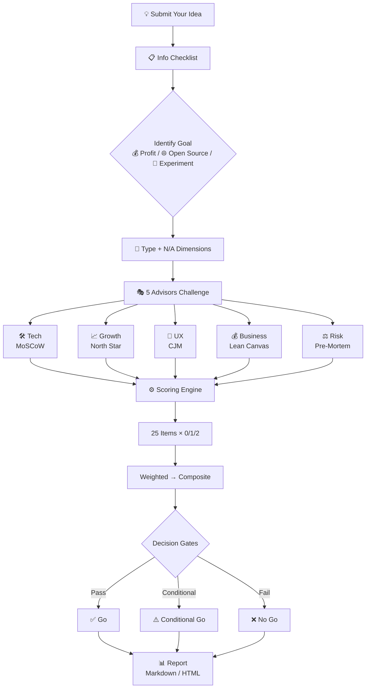

# OPC Board

[中文版](README-zh.md)

Everyone dreams of running a one-person company — freedom, independence, earning on your own terms.

**But between the idea and execution, there are countless pitfalls.** Ask a friend, they say "sounds great." Ask AI, it says "that's a wonderful idea." What you actually need is someone willing to challenge your thinking.

OPC Board gives you 5 professional advisors who stress-test your idea across 5 dimensions and output a **scored feasibility report** — not cheerleading, but an actionable Go / No Go decision.

## Workflow



## 5 Professional Advisors

| Advisor | What They Challenge |
|---|---|
| 🛠️ Tech Advisor | Can you build this alone? Who maintains it? |
| 📈 Growth Advisor | Where do users come from? How do you grow solo? |
| 🎨 Experience Advisor | Will users actually use this? |
| 💰 Business Advisor | Have you done the math? What happens when runway runs out? |
| ⚖️ Risk Advisor | Can you handle compliance issues alone? |

## Built-in Analysis Frameworks

Not guesswork. Five proven analysis models power the scoring, each advisor equipped with a dedicated tool:

| Framework | Advisor | What It Solves |
|------|------|-------------|
| **MoSCoW** | 🛠️ Tech | Must/Should/Could/Won't prioritization for solo builders |
| **North Star Metric** | 📈 Growth | Find the one metric that tells you if the product is alive or dead |
| **Customer Journey Map** | 🎨 Experience | 7-stage user journey audit, find experience gaps |
| **Lean Canvas** | 💰 Business | 9-block canvas to audit your business model completeness |
| **Pre-Mortem** | ⚖️ Risk | Classify risks into Tigers / Paper Tigers / Elephants |

## What You Get

A **professional feasibility report** (Markdown by default, upgradeable to visual HTML report):

- **5-Dimension Feasibility Score** (0-100) — 25 sub-items scored individually, formula-calculated, no guesswork
- **Fatal Flaw + Lifeline** — pinpoints your biggest risk and biggest opportunity
- **MoSCoW MVP Scoping** — Must / Should / Could / Won't, trim down to what one person can actually deliver
- **User Journey Review** — 7-stage Customer Journey Map, find experience breakpoints and Aha Moment
- **Pre-Mortem Risk Classification** — Tigers (truly fatal) / Paper Tigers (solvable) / Elephants (deliberately ignored)
- **OPC Decision Card** — ✅ Do it solo / ⚠️ Get help / ❌ Cut it + 3-week / 6-week / 3-month time-box
- **Action Checklist** — who does what by when

## Use Cases

- **Indie Developers**: Building SaaS / tools / plugins solo, need multi-perspective feedback
- **Open Source Authors**: Evaluate sustainability and community value before launching
- **SaaS Founders**: No one stress-tests your decisions, need outside perspective
- **Content Creators**: Pre-launch check for new courses / communities / newsletters
- **Independent Consultants**: Internal rehearsal before delivering client proposals
- **Anyone considering a side project**: Run a feasibility check before you quit your job

## Quick Start

```text
Review my AI weekly newsletter SaaS idea
```

## Install

```bash
openclaw skills install opc-board
```

---

> Before you commit, let five professional advisors stress-test it first.

License: MIT
