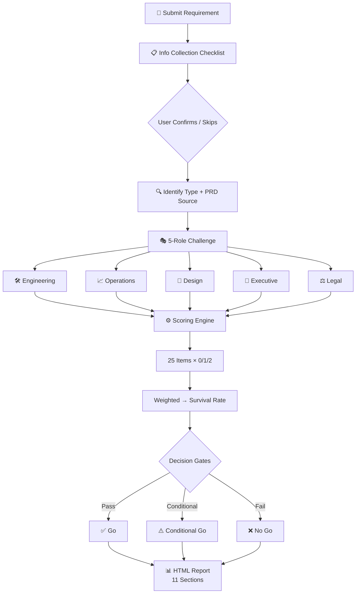

# PM Requirement Review Simulator

[中文版](README-zh.md)

> Stress-test your product requirements before the real meeting. Five cross-functional roles challenge your PRD with realistic pushback — outputs a scored HTML survival report.

## What It Does

Describe your product requirement and choose a difficulty level. The agent simulates a **cross-functional review meeting** where 5 roles — Engineering, Operations, Design, Executive, and Legal — each challenge your PRD with role-specific concerns and speaking styles. It then generates a **light-blue themed HTML report** (light-blue hero + white cards + SVG gauge & radar) with:

- **Survival Score** — deterministic scoring engine (per-item 0/1/2 weighted formula), not vibes
- **5-Dimension Radar Chart** — visual breakdown of strengths and fatal weaknesses
- **Decision Gates** — value / risk / resource / strategy gates with A/B/C option comparison
- **Counterargument Playbook** — TOP 3 hardest questions with "normal reply" vs "killer reply" + technique breakdown
- **RACI Matrix** — cross-team collaboration plan with conflict identification and resolution
- **Meeting Script** — ready-to-use opening, core argument, risk mitigation, decision, wrap-up
- **Action Checklist** — owner + deadline + deliverable + review checkpoint

## Difficulty Levels

| Level | Style | Best For |
|-------|-------|----------|
| 🟢 Rookie | Gentle suggestions, constructive tone | New PMs, first-time practice |
| 🟡 Realistic | Standard big-tech review intensity | Pre-meeting dry run |
| 🔴 Hell Mode | All hostile + industry jargon attacks | Senior PMs stress-testing edge cases |

## Quick Start

```text
Review my team's group-buying feature. Realistic mode.
```

The agent will output an **info collection checklist** first (goal, scope, constraints, etc.), then generate the full report after confirmation.

## Workflow



1. **Input**: identify requirement type (major feature / tool / MVP / iteration / compliance) + PRD source
2. **Processing**: 5 roles challenge by persona, per-item scoring, weight normalization, survival rate
3. **Output**: generate 11-section HTML report (light-blue theme)

## Report Sections

| # | Section | Description |
|---|---------|-------------|
| 1 | Hero | Requirement overview, grade badge, decision label |
| 2 | Radial Hub | Survival gauge + 5-dimension radar chart |
| 3 | Callouts | Fatal Flaw / Lifeline highlights |
| 4 | Decision Gates + A/B/C Plans | Value/risk/resource/strategy gates + option comparison |
| 5 | Five-Role Challenge Board | Per-role questions sorted by fatal/major/minor |
| 6 | Killer Replies TOP 3 | Normal vs killer reply + technique analysis |
| 7 | Cross-Team Collaboration | RACI matrix + conflict identification & resolution |
| 8 | Review Meeting Script | Opening, core argument, risk plan, decision, close |
| 9 | Optimization Suggestions | Must-fix / optional / defer |
| 10 | Action Checklist | Owner + deadline + deliverable + review checkpoint |
| 11 | Disclaimer | AI-generated notice + scope of advice |

## File Structure

| File | Role |
|------|------|
| `SKILL.md` | Master rules (workflow + output spec + quality standards) |
| `references/user_templates.md` | User input templates (general + industry add-ons) |
| `references/scoring-engine-deterministic.md` | Deterministic scoring engine (weights, items, tiers, exemptions) |
| `references/review-playbook.md` | Role challenge handbook (personas + scripts + meeting flow) |
| `references/report-template-pro.html` | HTML report template (light-blue hero, 11 sections) |

## Install

```bash
openclaw skills install pm-requirement-review-simulator
```

License: MIT
